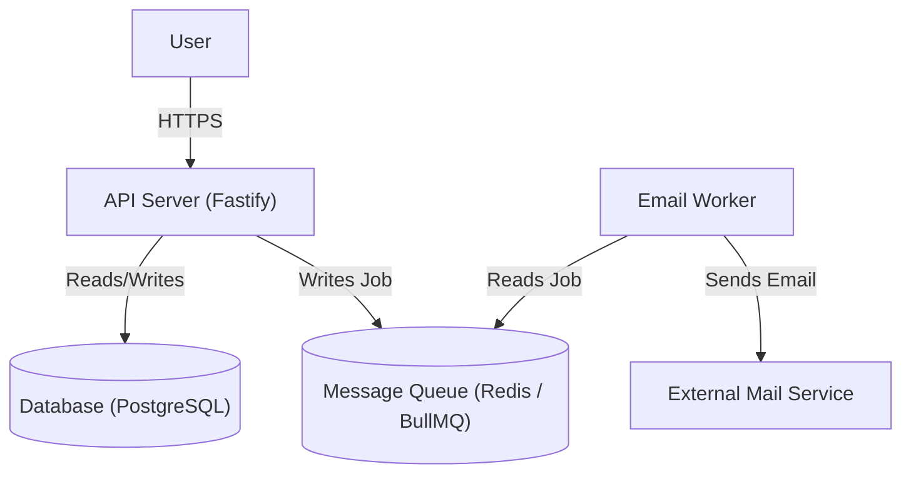

# Project: Turbo Recipes - System Design

This document outlines the system design for the Turbo Recipes API, a platform for users to create, share, and discover recipes.

---

## 1. Requirements Definition

### 1.1. Functional Requirements (FRs)

- **FR1:** Users must be able to create a new account (register).
- **FR2:** Users must be able to log in to their account (authenticate).
- **FR3:** Authenticated users must be able to create a new recipe.
- **FR4:** Any user must be able to view a specific recipe by its ID.
- **FR5:** Any user must be able to list all recipes with pagination.
- **FR6:** The user who created a recipe must be able to edit it.
- **FR7:** The user who created a recipe must be able to delete it.
- **FR8:** An authenticated user must be able to retrieve their own profile information.
- **FR9:** An authenticated user must be able to update their own profile information (name and password).
- **FR10:** An authenticated user must be able to delete their own account.
- **FR11:** Users must be able to search for recipes by title or ingredients.
- **FR12:** A user must be able to request a password reset for their email.
- **FR13:** A user must be able to reset their password using a token sent to their email.


### 1.2. Non-Functional Requirements (NFRs)

- **NFR1 - Latency:** Read requests should respond in < 200ms on average. Write requests should respond in < 400ms.
- **NFR2 - Consistency > Availability:** Data must be strongly consistent. This aligns with the CAP theorem, prioritizing that reads always return the most recently written data.
- **NFR3 - Availability:** The system should aim for high availability (e.g., 99.9% uptime).
- **NFR4 - Scalability (Initial):** The system should handle up to 10,000 users and 100,000 recipes, with peaks of 100 requests per second (RPS).

---

## 2. High-Level Architecture

### 2.1. System Architecture Diagram

For our initial version (MVP), the architecture is a simple monolith containing the core application logic and connecting directly to a relational database.



### 2.2. Data Model / Entities

- **User:**
  - `id`: uuid (Primary Key)
  - `name`: varchar(255) (not null)
  - `email`: varchar(255) (not null, unique)
  - `password_hash`: varchar(255) (not null)
  - `created_at`: timestamp (not null)
  - `updated_at`: timestamp (not null)

- **Recipe:**
  - `id`: uuid (Primary Key)
  - `title`: varchar(255) (not null)
  - `ingredients`: text (not null)
  - `method`: text (not null)
  - `author_id`: uuid (Foreign Key to users.id, on delete: set null)
  - `searchableText`: tsvector (generated column)
  - `created_at`: timestamp (not null)
  - `updated_at`: timestamp (not null)

- **PasswordResetToken:**
  - `id`: uuid (Primary Key)
  - `token`: varchar(255) (not null, unique)
  - `user_id`: uuid (Foreign Key to users.id, on delete: cascade)
  - `expires_at`: timestamp (not null)

- **Relationship:** A `User` can have many `Recipes` (One-to-Many).

---

## 3. API Contract (Endpoints)

The API will be RESTful and communicate using JSON.

### 3.1. Users & Sessions

#### `POST /users`
- **Description:** Creates a new user.
- **Request Body:**
  ```json
  {
    "name": "string",
    "email": "string",
    "password": "string"
  }
  ```
- **Success Response:** `201 Created` with a user object: `{ "user": { ... } }`
- **Error Responses:** `400 Bad Request` (Invalid input), `409 Conflict` (Email already in use).

#### `POST /sessions`
- **Description:** Authenticates a user and returns a token.
- **Request Body:**
  ```json
  {
    "email": "string",
    "password": "string"
  }
  ```
- **Success Response:** `200 OK` with `{ "token": "jwt_token_here" }`
- **Error Responses:** `401 Unauthorized` (Invalid credentials).

#### `GET /me`
- **Description:** Retrieves the profile of the currently authenticated user. (Requires authentication).
- **Success Response:** `200 OK` with a user object: `{ "user": { ... } }`
- **Error Responses:** `401 Unauthorized`.

#### `PATCH /me`
- **Description:** Updates the profile of the currently authenticated user. (Requires authentication).
- **Request Body:**
  ```json
  {
    "name": "string",
    "oldPassword": "string",
    "newPassword": "string"
  }
  ```
  *(Note: All fields are optional. If `newPassword` is provided, `oldPassword` is required).*
- **Success Response:** `200 OK` with an updated user object: `{ "user": { ... } }`
- **Error Responses:** `400 Bad Request` (Invalid input), `401 Unauthorized`.

#### `DELETE /me`
- **Description:** Deletes the currently authenticated user's account. (Requires authentication).
- **Success Response:** `204 No Content`.
- **Error Responses:** `401 Unauthorized`.

### 3.2. Password

#### `POST /password/forgot`
- **Description:** Requests a password reset for a given email. The server will send an email with a reset link if the user exists. Always returns a success response to prevent email enumeration.
- **Request Body:**
  ```json
  {
    "email": "string"
  }
  ```
- **Success Response:** `204 No Content`.
- **Error Responses:** `400 Bad Request`.

#### `POST /password/reset`
- **Description:** Resets the password using a token from the "forgot password" email.
- **Request Body:**
  ```json
  {
    "token": "string",
    "password": "string"
  }
  ```
- **Success Response:** `204 No Content`.
- **Error Responses:** `400 Bad Request` (Invalid token or weak password).

### 3.3. Recipes

#### `POST /recipes`
- **Description:** Creates a new recipe. (Requires authentication).
- **Request Body:**
  ```json
  {
    "title": "string",
    "ingredients": "string",
    "method": "string"
  }
  ```
- **Success Response:** `201 Created` with a recipe object: `{ "recipe": { ... } }`
- **Error Responses:** `400 Bad Request`, `401 Unauthorized`.

#### `GET /recipes/:id`
- **Description:** Retrieves a single recipe by its ID.
- **Success Response:** `200 OK` with a recipe object: `{ "recipe": { ... } }`
- **Error Responses:** `404 Not Found`.

#### `GET /recipes`
- **Description:** Retrieves a list of recipes with pagination.
- **Query Parameters:** `?page=1&limit=10`
- **Success Response:** `200 OK` with a paginated list of recipes: `{ "recipes": [ ... ] }`

#### `PATCH /recipes/:id`
- **Description:** Updates a recipe. (Requires authentication and ownership).
- **Request Body:**
  ```json
  {
    "title": "string",
    "ingredients": "string",
    "method": "string"
  }
  ```
- **Success Response:** `200 OK` with an updated recipe object: `{ "recipe": { ... } }`
- **Error Responses:** `400 Bad Request`, `401 Unauthorized`, `403 Forbidden` (User is not the owner), `404 Not Found`.

#### `DELETE /recipes/:id`
- **Description:** Deletes a recipe. (Requires authentication and ownership).
- **Success Response:** `204 No Content`
- **Error Responses:** `401 Unauthorized`, `403 Forbidden` (User is not the owner), `404 Not Found`.

#### `GET /recipes/search`
- **Description:** Searches for recipes by title or ingredients.
- **Query Parameters:** `?q=bolo de chocolate&page=1&limit=10`
- **Success Response:** `200 OK` with a paginated list of recipes, ordered by relevance.

---

## 4. Observability

### 4.1. Goals

To ensure the reliability and performance of the Turbo Recipes API in a production environment, we will implement an observability stack to answer the following key questions:
- **System Health:** What is the current status of our service's resources (CPU, memory usage)?
- **Performance/Latency:** Which API endpoints are the slowest? What is the average and p99 latency for each route?
- **Throughput:** How many requests per second (RPS) is each endpoint handling?
- **Error Rate:** What is the rate of successful (`2xx`) versus failed (`4xx`, `5xx`) responses?
- **Root Cause Analysis:** When an error occurs, what is the full context (logs, traces) needed to debug it quickly?

### 4.2. Chosen Stack

For this project, we will adopt a modern, powerful, and widely-used open-source stack, instrumented via the OpenTelemetry standard.

- **OpenTelemetry (OTel):** The standard for instrumenting our application. It allows us to generate and export logs, metrics, and traces in a vendor-neutral way.
- **Prometheus:** A time-series database for collecting and storing **Metrics**.
- **Loki:** A log aggregation system for collecting and storing **Logs**.
- **Grafana:** A visualization tool to create dashboards that display data from both Prometheus and Loki.

This stack, often called the "PLG Stack" (Prometheus, Loki, Grafana), provides a comprehensive, production-grade observability solution.
