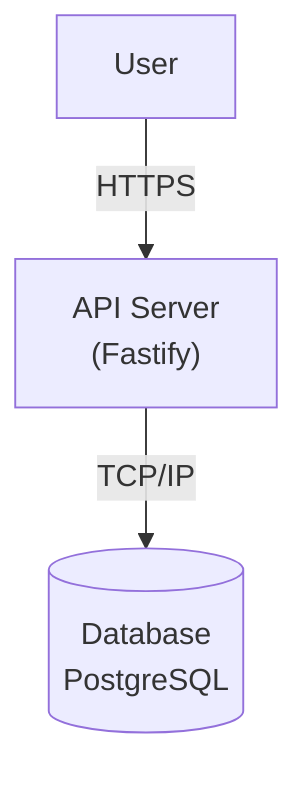

# Project: Turbo Recipes - System Design

This document outlines the system design for the Turbo Recipes API, a platform for users to create, share, and discover recipes.

---

## 1. Requirements Definition

### 1.1. Functional Requirements (FRs)

- **FR1:** Users must be able to create a new account (register).
- **FR2:** Users must be able to log in to their account (authenticate).
- **FR3:** Authenticated users must be able to create a new recipe.
- **FR4:** Any user must be able to view a specific recipe by its ID.
- **FR5:** Any user must be able to list all recipes with pagination.
- **FR6:** The user who created a recipe must be able to edit it.
- **FR7:** The user who created a recipe must be able to delete it.
- **FR8 [v2]:** Users must be able to search for recipes by title or ingredients.

### 1.2. Non-Functional Requirements (NFRs)

- **NFR1 - Latency:** Read requests should respond in < 200ms on average. Write requests should respond in < 400ms.
- **NFR2 - Consistency > Availability:** Data must be strongly consistent. This aligns with the CAP theorem, prioritizing that reads always return the most recently written data.
- **NFR3 - Availability:** The system should aim for high availability (e.g., 99.9% uptime).
- **NFR4 - Scalability (Initial):** The system should handle up to 10,000 users and 100,000 recipes, with peaks of 100 requests per second (RPS).

### 1.3. Capacity Estimates (Out of Scope for MVP)

*This section will be detailed in more complex projects, involving calculations for storage, memory, and bandwidth based on the scale requirements.*

---

## 2. High-Level Architecture

### 2.1. System Architecture Diagram

For our initial version (MVP), the architecture is a simple monolith containing the core application logic and connecting directly to a relational database.



### 2.2. Data Model / Entities

- **User:**
  - `id`: (Primary Key)
  - `name`: string
  - `email`: string (unique)
  - `password_hash`: string
  - `created_at`: timestamp
  - `updated_at`: timestamp

- **Recipe:**
  - `id`: (Primary Key)
  - `title`: string
  - `ingredients`: text
  - `method`: text
  - `author_id`: (Foreign Key to User.id)
  - `created_at`: timestamp
  - `updated_at`: timestamp

- **Relationship:** A `User` can have many `Recipes` (One-to-Many).

---

## 3. API Contract (Endpoints)

The API will be RESTful and communicate using JSON.

### 3.1. Users & Sessions

#### `POST /users`
- **Description:** Creates a new user.
- **Request Body:**
  ```json
  {
    "name": "string",
    "email": "string",
    "password": "string"
  }
  ```
- **Success Response:** `201 Created`
- **Error Responses:** `400 Bad Request` (Invalid input), `409 Conflict` (Email already in use. *Note: For higher security systems, a generic response is often preferred to prevent user enumeration*).

#### `POST /sessions`
- **Description:** Authenticates a user and returns a token.
- **Request Body:**
  ```json
  {
    "email": "string",
    "password": "string"
  }
  ```
- **Success Response:** `200 OK` with `{ "token": "jwt_token_here" }`
- **Error Responses:** `400 Bad Request` (Invalid credentials).

### 3.2. Recipes

#### `POST /recipes`
- **Description:** Creates a new recipe. (Requires authentication).
- **Request Body:**
  ```json
  {
    "title": "string",
    "ingredients": "string",
    "method": "string"
  }
  ```
- **Success Response:** `201 Created` with the created recipe object.
- **Error Responses:** `400 Bad Request`, `401 Unauthorized`.

#### `GET /recipes/:id`
- **Description:** Retrieves a single recipe by its ID.
- **Success Response:** `200 OK` with the recipe object.
- **Error Responses:** `404 Not Found`.

#### `GET /recipes`
- **Description:** Retrieves a list of recipes with pagination.
- **Query Parameters:** `?page=1&limit=10`
- **Success Response:** `200 OK` with a paginated list of recipes.

#### `PATCH /recipes/:id`
- **Description:** Updates a recipe. (Requires authentication and ownership).
- **Request Body:**
  ```json
  {
    "title": "string",
    "ingredients": "string",
    "method": "string"
  }
  ```
- **Success Response:** `200 OK` with the updated recipe object.
- **Error Responses:** `400 Bad Request`, `401 Unauthorized`, `403 Forbidden` (User is not the owner), `404 Not Found`.

#### `DELETE /recipes/:id`
- **Description:** Deletes a recipe. (Requires authentication and ownership).
- **Success Response:** `204 No Content`
- **Error Responses:** `401 Unauthorized`, `403 Forbidden` (User is not the owner), `404 Not Found`.

#### `GET /recipes/search` [v2]
- **Description:** Searches for recipes by title or ingredients.
- **Query Parameters:** `?q=bolo de chocolate&page=1&limit=10`
- **Success Response:** `200 OK` with a paginated list of recipes, ordered by relevance.
